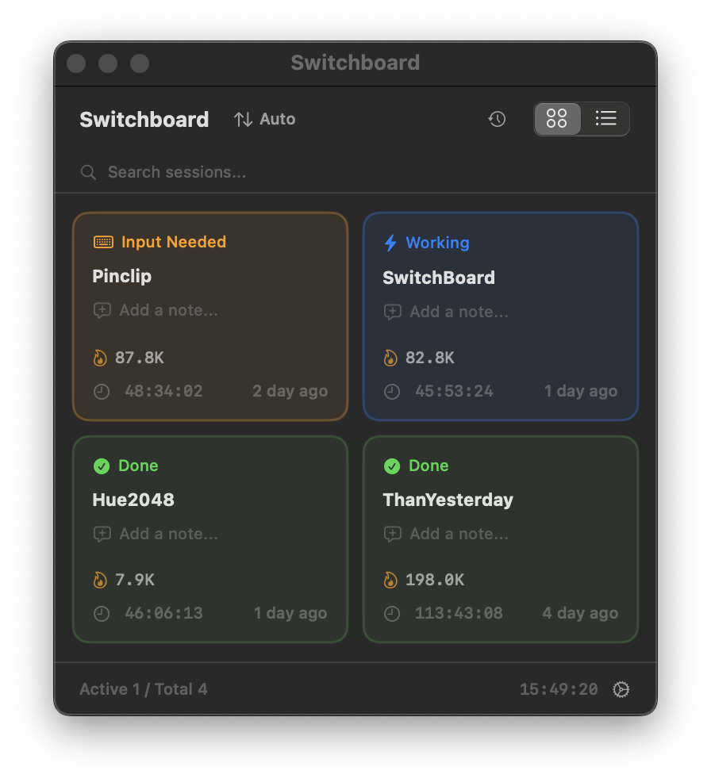
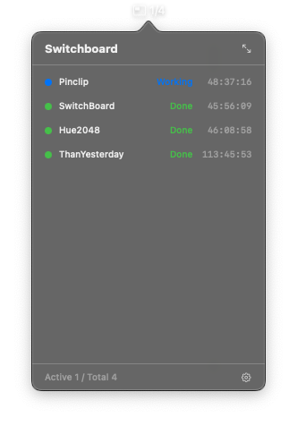
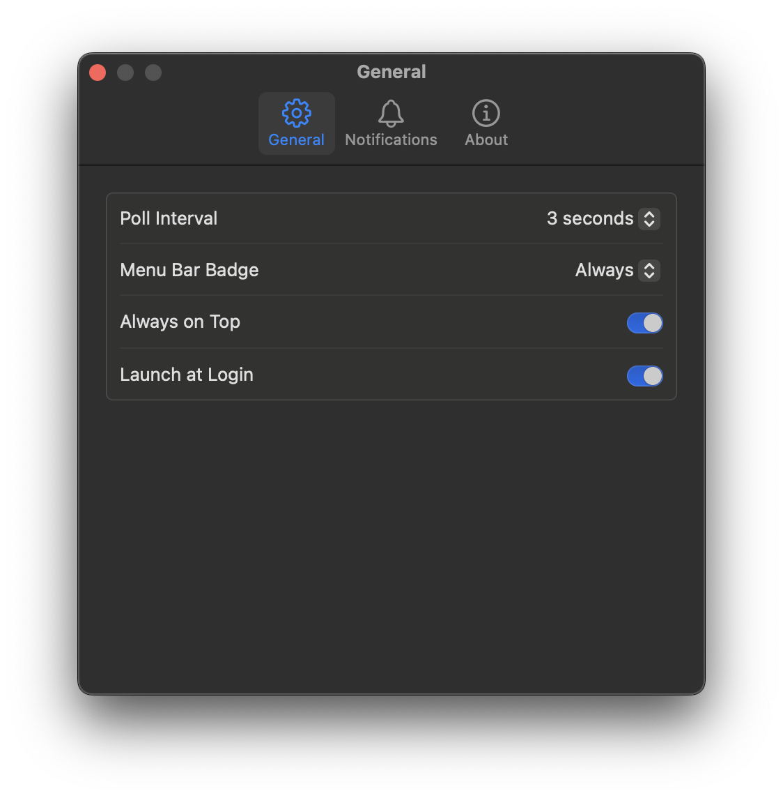

# SwitchBoard

A macOS menu bar app that monitors your Claude Code sessions at a glance.

If you run multiple Claude Code instances across different terminal tabs, SwitchBoard shows you what each one is doing — working, waiting for input, or done — in a single dashboard.



<p align="center">
  
  &nbsp;&nbsp;
  
</p>

## Features

### Session monitoring
- **Instant status transitions** — Driven by Claude Code hooks, not polling. Working / Done / Needs-input flip the moment Claude changes state.
- **Status types:**
  - ⚡ **Working** — Claude is actively processing
  - ⌨️ **Needs Input** — Waiting for your input
  - ✅ **Done** — Turn completed
  - 🌙 **Idle** — Session ended
- **Token usage** — Shows input/output + cache token counts per session
- **Estimated API cost** — Per-model pricing next to token usage. Pricing auto-refreshes from the LiteLLM feed every 3 days with a hardcoded fallback. Can be toggled off in Preferences. (This is an API-equivalent estimate, not your actual Pro/Max subscription billing.)
- **MCP servers** — Each tile shows the MCP servers configured for that session (parsed from `~/.claude.json` global/per-project scope and any project-local `.mcp.json`). Click the pill to see the full list.

### Dashboard
- **Grid & List views** — Toggle between tile grid and compact list
- **Drag & drop** — Reorder session tiles to your preference
- **Search** — Filter sessions by project name or memo (4+ sessions)
- **Session memos** — Add notes to each session
- **History timeline** — View status transitions over time
- **Click to focus** — Jump to the corresponding terminal/IDE window
- **Terminate sessions** — Kill a session via right-click context menu
- **Attention pulse** — Cards pulse when work completes or input is required, and unacknowledged sessions sort first within their status. Click the card (or send a new prompt) to dismiss. Toggle off in Preferences.

### Menu bar
- **Live badge** — Shows active session count (e.g. `1/4`) next to the icon
- **Quick popover** — Left-click for compact session list
- **Dashboard shortcut** — Right-click to open the full dashboard
- **Global hotkey** — `⌘⇧S` from anywhere to toggle the popover

### Notifications
- **Hook-driven, zero delay** — SwitchBoard registers itself as Claude Code `Stop` / `Notification` / `UserPromptSubmit` hooks on first launch. Dashboard and alerts flip the instant Claude stops — no polling lag, no false positives.
- **Automatic setup** — The app safely merges its entries into `~/.claude/settings.json` on launch. Any existing hooks you've added (e.g. `terminal-notifier`) are preserved untouched.
- **Smart idle filter** — Claude Code's periodic "waiting for your input" reminder does NOT flip state to needs-input. Only real attention-needed notifications (permission requests, etc.) do.
- **Webhooks** — Slack, Discord, Telegram integration
- **Custom messages & sounds** — Override default text and pick a distinct sound for done vs. needs-input

### Other
- **Auto-updates** — Built-in update checker via Sparkle
- **5 languages** — English, Korean, Japanese, Chinese (Simplified & Traditional)
- **Always on top** — Optional floating window mode
- **Launch at login**

## Requirements

- macOS 13.0 (Ventura) or later
- [Claude Code](https://claude.ai/code) running in one or more terminals

## Installation

### Download (recommended)

1. Download the latest `SwitchBoard.zip` from the [Releases](https://github.com/kkiruk-studio/SwitchBoard/releases) page
2. Unzip and move `SwitchBoard.app` to your `/Applications` folder
3. Launch it

The app is signed with a Developer ID and notarized by Apple, so it should launch without security warnings.

### Build from source

```bash
git clone https://github.com/kkiruk-studio/SwitchBoard.git
cd SwitchBoard
open SwitchBoard.xcodeproj
```

Then build and run in Xcode (⌘R).

## How it works

SwitchBoard splits session monitoring into two layers, each doing what it's best at:

**Hook layer (status transitions)** — On first launch, SwitchBoard merges its CLI into `~/.claude/settings.json` as three hooks. Claude Code fires them the instant each event happens:

- `UserPromptSubmit` → working
- `Stop` → done
- `Notification` → needs-input (idle reminders filtered out)

The hook fires a tiny CLI that sends a Darwin distributed notification to the running app — typically under 10 ms end to end.

**Polling layer (inventory)** — Every 3 seconds, SwitchBoard reads `~/.claude/sessions/*.json` to discover new sessions, detect dead PIDs (crashes, `kill -9`), and accumulate tokens/cost from the JSONL transcripts. Status detection from JSONL is used only to bootstrap sessions that existed before hooks were installed; once any hook has fired for a session, hooks are the single source of truth.

No server required. No network calls (except optional webhooks). Everything is local.

## Settings

- **Menu bar badge** — Always / Active only / Icon only
- **Always on top** — Keep the window above all others
- **Launch at login** — Start automatically when you log in
- **Notifications** — Enable/disable, custom messages, distinct sounds for done vs. needs-input
- **Webhooks** — Slack / Discord / Telegram

## Webhook Setup

### Slack
1. Go to your [Slack App settings](https://api.slack.com/apps)
2. Select your app (or create one) → **Incoming Webhooks** → Enable
3. Click **Add New Webhook to Workspace** → Select a channel
4. Copy the Webhook URL → Paste into SwitchBoard settings

### Discord
1. Open your Discord server → **Server Settings** → **Integrations**
2. Click **Webhooks** → **New Webhook**
3. Select a channel → **Copy Webhook URL**
4. Paste into SwitchBoard settings

### Telegram
1. Open Telegram and search for **@BotFather**
2. Send `/newbot` → Follow prompts to name your bot
3. Copy the **Bot Token** (e.g. `123456:ABC-DEF...`) → Paste into SwitchBoard settings
4. Search for **@userinfobot** → Send any message → It replies with your **Chat ID** → Paste into settings
5. **Important:** Send any message to your new bot once — this activates the bot so it can send you notifications

## License

MIT

---

Made by [kkiruk studio](https://github.com/kkiruk-studio)
